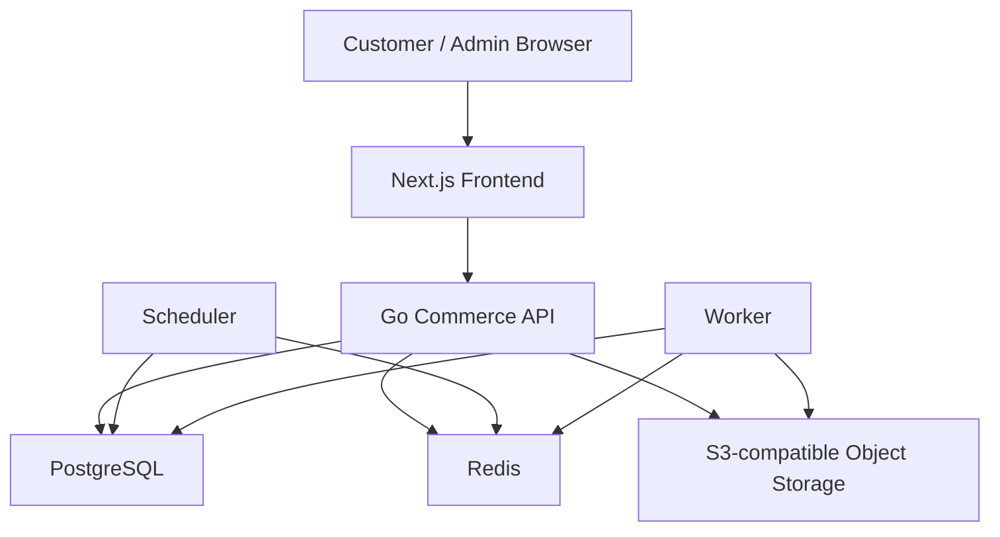
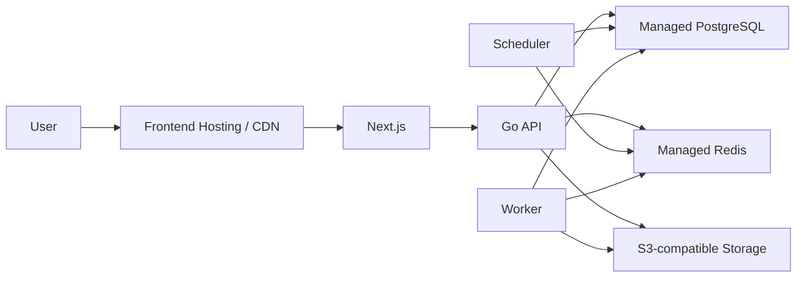

<div align="center">


# Ene Dei

### Precision Commerce

A full-stack commerce platform combining a customer storefront, account experience,
operational Admin console, commerce backend, fulfillment workflows, sourcing,
finance, notifications, inventory, support, and deployment-ready infrastructure.

</div>

## Contents

- [Overview](#overview)
- [Core capabilities](#core-capabilities)
- [Architecture](#architecture)
- [Repository structure](#repository-structure)
- [Technology stack](#technology-stack)
- [Customer experience](#customer-experience)
- [Admin platform](#admin-platform)
- [Backend domains](#backend-domains)
- [Product Request and sourcing](#product-request-and-sourcing)
- [Notifications](#notifications)
- [Security](#security)
- [Database and migrations](#database-and-migrations)
- [Object storage](#object-storage)
- [PWA support](#pwa-support)
- [Local development](#local-development)
- [Backend development](#backend-development)
- [Frontend development](#frontend-development)
- [Testing and validation](#testing-and-validation)
- [Environment configuration](#environment-configuration)
- [Production architecture](#production-architecture)
- [Deployment model](#deployment-model)
- [Development rules](#development-rules)
- [Git workflow](#git-workflow)
- [Project status](#project-status)

---

# Overview

**Ene Dei** is a commerce platform built around a production-oriented architecture rather
than a demonstration-only application.

The system consists of two primary application layers:

- a **Go commerce backend**
- a **Next.js customer and Admin frontend**

The platform is designed around real commerce workflows including catalog management,
inventory, checkout, orders, payments, invoices, delivery, returns, refunds, sourcing,
CRM/support, notifications, finance, staff access control, reviews, promotions and customer
account management.

The repository intentionally keeps business logic in the backend and presents it through a
responsive, data-driven frontend.

The application architecture is designed so that development, Docker, CI/CD and production
environments use the same core application rather than maintaining separate demo and
production implementations.

---

# Core capabilities

Ene Dei currently contains functionality across the complete commerce lifecycle.

### Commerce

- Product catalog
- Categories
- Product variants
- Product media
- Product codes and SKU identity
- Search and suggestions
- Cart
- Buy now
- Checkout
- Delivery options
- Payment initiation
- Orders
- Order history
- Order timeline
- Invoices
- Promotions
- Product discounts
- Flash-sale campaigns
- Wishlist
- Reviews

### Operations

- Inventory management
- Inventory reservations
- Warehouses
- Picking
- Packing
- Shipment management
- Delivery dispatch
- Rider workflows
- Delivery tracking
- Delivery verification
- Returns
- Refunds

### Customer operations

- Customer account
- Addresses
- Profile and avatar
- Account security
- Session management
- Notifications
- Orders
- Returns
- Wishlist
- Product Requests
- Sourcing conversations
- Customer support

### Business operations

- Admin dashboard
- Staff accounts
- Roles and permissions
- MFA
- Staff onboarding
- Staff lifecycle controls
- CRM
- Customer support
- Finance
- Expenses
- Profit/loss reporting
- Catalog import
- Product management
- Inventory
- Orders
- Fulfillment
- Shipments
- Returns
- Reviews
- Promotions
- Product sourcing

---

# Architecture



The frontend does not duplicate backend business rules.

The backend remains the source of truth for commercial operations such as:

- pricing
- order state
- inventory
- sourcing agreements
- payments
- fulfillment
- permissions
- finance
- notifications

---

# Repository structure

```text
e-commerce/
│
├── backend/
│   │
│   ├── commerce-api/
│   │   ├── api/
│   │   ├── cmd/
│   │   ├── db/
│   │   │   ├── migrations/
│   │   │   └── schema.pg.hcl
│   │   ├── deploy/
│   │   ├── integrations/
│   │   ├── internal/
│   │   ├── jobs/
│   │   ├── scheduler/
│   │   ├── scripts/
│   │   ├── seeds/
│   │   ├── tests/
│   │   ├── Dockerfile
│   │   ├── docker-compose.yml
│   │   ├── atlas.hcl
│   │   ├── go.mod
│   │   └── go.sum
│   │
│   ├── ai-service/
│   │   └── Future service workspace
│   │
│   ├── infrastructure/
│   │   └── Future infrastructure workspace
│   │
│   └── shared/
│       ├── constants/
│       └── contracts/
│
├── frontend/
│   ├── public/
│   ├── scripts/
│   ├── src/
│   │   ├── app/
│   │   ├── components/
│   │   └── lib/
│   ├── next.config.ts
│   ├── package.json
│   ├── package-lock.json
│   └── tsconfig.json
│
├── .gitattributes
├── .gitignore
└── README.md
```

`backend/commerce-api` is the active commerce backend.

The additional backend workspaces exist so future services or infrastructure components can
be introduced without restructuring the repository.

---

# Technology stack

## Backend

- **Go**
- **Gin HTTP framework**
- **PostgreSQL**
- **pgvector**
- **pg_trgm**
- **Redis**
- **Atlas**
- **Docker**
- **Docker Compose**
- S3-compatible object storage
- Background scheduler
- Queue worker architecture

## Frontend

- **Next.js**
- **React**
- **TypeScript**
- CSS Modules
- App Router
- Server and client components
- Route handlers / BFF endpoints
- Dynamic Admin portal routing
- Progressive Web App metadata and icons

## Infrastructure

Development infrastructure includes:

- PostgreSQL
- Redis
- local S3-compatible storage
- API service
- scheduler
- worker

The production architecture is designed for managed equivalents of these services.

---

# Customer experience

The customer-facing application includes the primary commerce and account journeys required
for an end-to-end shopping experience.

## Storefront

- Homepage
- Dynamic catalog feed
- Categories
- Category browsing
- Product detail pages
- Variant selection
- Product media galleries
- Product recommendations
- Search
- Search suggestions
- Visual/image-search interface
- Flash-sale presentation
- Promotions
- Wishlist
- Cart
- Checkout

## Customer account

Customers can access:

```text
/account
/account/orders
/account/addresses
/account/returns
/account/security
/account/settings
/account/support
/account/request
/account/wishlist
```

The account experience includes:

- account overview
- order history
- order detail
- order timeline
- invoice access
- delivery tracking
- cancellation flows
- returns
- addresses
- profile settings
- avatar
- security/session controls
- customer support
- notifications
- Product Request sourcing
- wishlist

---

# Admin platform

Ene Dei includes a permission-aware operational Admin environment.

Major Admin workspaces include:

```text
Dashboard
Analytics
Customers
Products
Catalog Import
Inventory
Orders
Fulfillment
Shipments
Returns
Reviews
Promotions
Product Requests
Support
Notifications
Staff & Roles
Account Security
```

The Admin frontend is backed by real backend contracts rather than hard-coded management
data.

---

# Backend domains

The Go backend is organized around domain-oriented packages.

Major domains include:

```text
admin
adminauth
auth
cart
catalog
catalogimport
catalogmediawrite
catalogwrite
category
checkout
crm
customer
customeraccess
delivery
finance
fraud
inventory
notification
order
payment
pricing
productrequest
promotion
recommendation
refund
returns
review
rider
search
staff
support
supportattachment
warehouse
wishlist
```

Platform infrastructure includes:

```text
cache
config
database
errors
httpclient
logger
metrics
middleware
pagination
queue
router
security
storage
validation
```

This architecture is intentionally modular so new functionality can reuse existing commerce
domains instead of creating parallel order, payment, inventory or fulfillment systems.

---

# Product Request and sourcing

Product Request is a dedicated sourcing workflow for products that are not handled through
ordinary catalog checkout.

The workflow supports:

```text
Customer Request
      ↓
Staff Review
      ↓
Customer / Staff Conversation
      ↓
Structured Offer
      ↓
Customer Accept / Reject
      ↓
Final Agreement
      ↓
Sourcing Checkout
      ↓
Sourcing Order
      ↓
Procurement
      ↓
Inventory / Fulfillment
      ↓
Delivery
```

A finalized sourcing agreement becomes immutable commercial truth.

The locked agreement includes values such as:

- product identity
- specifications
- quantity
- minimum order quantity
- unit price
- shipping price
- currency
- total

The customer does not resend or override those commercial values during sourcing checkout.

Sourcing orders reuse the existing order, payment, invoice, fulfillment, tracking and
delivery systems instead of operating as an unrelated order subsystem.

---

# Notifications

Ene Dei contains separate notification experiences for customers and operational staff.

## Customer notifications

Customer notifications support:

- notification inbox
- unread summary
- mark one as read
- mark all as read
- account-related events
- commerce-related events

## Admin notifications

Admin/staff notifications support operational events including:

- new orders
- Product Requests
- sourcing updates
- low inventory
- customer support activity
- escalations
- operational events

Admin notification read state is maintained per staff member.

The backend notification pipeline uses:

```text
Domain event
    ↓
Notification outbox
    ↓
Scheduler
    ↓
Redis queue
    ↓
Worker
    ↓
Notification delivery / inbox persistence
```

---

# Security

Security is treated as a platform concern rather than an individual feature.

The project includes mechanisms for:

- customer authentication
- Admin authentication
- secure sessions
- CSRF protection
- security headers
- rate limiting
- request identity
- password hashing
- encrypted sensitive material
- staff MFA
- TOTP enrollment
- recovery codes
- staff access states
- account bans
- permission-aware Admin routes
- staff role management
- invitation-based staff activation infrastructure
- signed/private storage access
- protected support attachments

Secrets must never be committed to Git.

Real environment files are excluded through `.gitignore`.

Use `.env.example` only as a configuration template.

---

# Database and migrations

The backend uses PostgreSQL with Atlas-managed schema migrations.

The canonical schema is:

```text
backend/commerce-api/db/schema.pg.hcl
```

Generated migrations are stored under:

```text
backend/commerce-api/db/migrations/
```

## Schema workflow

Database changes follow a schema-first workflow:

1. Modify `db/schema.pg.hcl`.
2. Generate a migration using Atlas schema diff.
3. Inspect the generated SQL.
4. Check migration status.
5. Run the migration preview/dry run.
6. Verify that only the intended schema changes are present.
7. Apply the migration to the required environment.
8. Check migration status again.
9. Verify the resulting database schema.

Already-applied migrations must not be modified.

Hand-written migrations should not replace Atlas schema diff when the change can be generated
from the canonical schema.

---

# Object storage

The backend provides an S3-compatible storage abstraction.

Storage is used for functionality such as:

- product media
- customer avatars
- support attachments
- private media
- signed upload/download workflows

Local development can use local S3-compatible infrastructure.

Production can use an S3-compatible managed object-storage provider without changing the
application storage interface.

Private support files are not treated as public storefront media.

---

# PWA support

The storefront includes Progressive Web App metadata and installable application icons.

PWA icons are stored under:

```text
frontend/public/icons/pwa/
```

They include:

```text
apple-touch-icon.png
icon-192.png
icon-512.png
maskable-512.png
```

The reusable generation script is:

```powershell
cd frontend
.\scripts\generate-pwa-icons.ps1
```

The project intentionally does not rely on an offline-first service-worker architecture for
core commerce operations.

---

# Local development

## Prerequisites

Install:

- Git
- Docker Desktop / Docker Engine
- Docker Compose
- Go
- Node.js
- npm
- Atlas when performing schema development

Clone the repository:

```bash
git clone https://github.com/ashklucy5/e-commerce.git
cd e-commerce
```

---

# Backend development

The core backend is located at:

```text
backend/commerce-api
```

## Environment

Create a local environment file from the example:

### PowerShell

```powershell
cd backend\commerce-api
Copy-Item .env.example .env
```

### Bash

```bash
cd backend/commerce-api
cp .env.example .env
```

Configure the local values required by your environment.

Never commit `.env`.

---

## Docker development

From:

```text
backend/commerce-api
```

start the local backend stack:

```bash
docker compose up -d --build
```

The development stack contains the main runtime services:

```text
postgres
redis
api
scheduler
worker
```

Local object storage may also be started by the Compose configuration.

Check containers:

```bash
docker compose ps
```

The API readiness endpoint in the default local Compose environment is:

```text
http://127.0.0.1:8081/health/ready
```

Stop the stack:

```bash
docker compose down
```

---

## Building the Go backend

```bash
cd backend/commerce-api
go build ./...
```

Run tests:

```bash
go test ./...
```

The Docker image builds the executable commands under `cmd/` and provides the binaries to
the runtime image.

Important runtime programs include:

```text
api
scheduler
worker
```

---

# Frontend development

The frontend is located at:

```text
frontend/
```

Install dependencies:

```bash
cd frontend
npm ci
```

Start the development server:

```bash
npm run dev
```

Create a production build:

```bash
npm run build
```

Run the production frontend using the script defined by the Next.js application:

```bash
npm run start
```

The frontend should communicate with the configured backend/API environment rather than
reimplementing backend business rules in browser code.

---

# Testing and validation

Testing is performed at multiple levels.

## Backend

Standard Go tests:

```bash
cd backend/commerce-api
go test ./...
```

Docker/runtime validation:

```powershell
cd backend\commerce-api
.\scripts\docker_backend_validation.ps1
```

The backend repository also contains focused validation and end-to-end scripts under:

```text
backend/commerce-api/scripts/
```

including validation for areas such as:

- Admin MFA
- Product Requests
- sourcing
- finance
- notification pipelines
- full black-box flows

Some integration tests require explicitly configured test infrastructure and should not be
run against production databases.

---

## Frontend

Production build validation:

```bash
cd frontend
npm run build
```

The production build is the primary frontend compile/type/build gate.

The project should not be considered deployment-ready after a change until the appropriate
build or runtime verification has actually passed.

---

# Environment configuration

Configuration is environment-driven.

Do not hard-code production credentials into source files.

## PostgreSQL

Development/local environments use the normal PostgreSQL configuration namespace.

Production application runtime configuration is separated from direct database
administration/migration configuration.

The project distinguishes application database connectivity from direct migration
connectivity so deployment platforms can use pooled connections while Atlas/schema
operations use a direct PostgreSQL endpoint.

---

## Redis

Development can use a local Redis instance.

Production supports a managed Redis URL with TLS.

Queue, cache and background-job behavior should continue using the existing Redis
abstractions.

---

## Storage

Storage configuration uses the backend S3-compatible storage abstraction.

Typical configuration categories include:

```text
provider
endpoint
region
bucket
access key
secret key
public/private URL behavior
```

Never commit real storage credentials.

---

# Production architecture

The production architecture is designed around managed infrastructure.

A typical production topology is:



The current production infrastructure strategy is compatible with services such as:

- Neon for PostgreSQL
- Upstash for Redis
- Backblaze B2 for S3-compatible object storage

Provider configuration belongs in deployment environment variables and infrastructure
configuration, not in application source code.

---

# Deployment model

Ene Dei uses a source-driven deployment model.

The expected flow is:

```text
GitHub
   ↓
Deployment Platform
   ↓
Install dependencies / build source
   ↓
Deploy runtime
```

The repository should not contain pre-built local executables, `.next` output, local
archives or secret environment files.

## Backend

The backend can be deployed from:

```text
backend/commerce-api
```

using its Dockerfile.

The same backend image contains the required command binaries and can be started as separate
runtime services for:

```text
api
scheduler
worker
```

## Frontend

The frontend should be deployed from:

```text
frontend
```

The deployment platform should install dependencies and run the production Next.js build
automatically from source.

Local `.next` output should not be uploaded to GitHub.

---

# Development rules

Several architectural rules are important to preserve.

## Backend

- Reuse existing domains instead of creating duplicate systems.
- Orders remain the canonical order system.
- Payments remain the canonical payment system.
- Inventory remains the canonical stock system.
- Delivery and fulfillment remain shared across order types.
- Sourcing orders integrate into normal order infrastructure.
- Database changes must use the Atlas schema-first workflow.
- Already-applied migrations must not be rewritten.
- Commercial truth must be derived from server-side state.
- Clients must not be trusted to resend locked pricing or agreement values.

## Frontend

- Frontend pages must remain data-driven.
- Avoid hard-coded fake commerce data.
- Preserve semantic HTML.
- Preserve accessibility.
- Preserve responsive behavior.
- Technical SEO is a first-class requirement.
- Metadata, canonicals, robots, sitemap and structured content should remain correct.
- Avoid moving backend business rules into the frontend.
- Keep customer and Admin workflows aligned with backend contracts.

---

# Design system

The customer storefront uses the Ene Dei visual identity:

- Ene red
- white and off-white surfaces
- charcoal typography
- restrained liquid-glass treatment
- layered translucent surfaces
- subtle depth
- refined spacing
- accessible contrast
- responsive layouts

The Admin application uses its own operational visual system while sharing the broader Ene
Dei product identity.

The goal is a commerce interface that feels deliberate and distinctive rather than a generic
dashboard template.

---

# SEO

Technical SEO is considered part of the application architecture.

The frontend includes infrastructure for:

- metadata
- canonical URLs
- `robots`
- sitemap generation
- semantic HTML
- heading hierarchy
- crawlable commercial pages
- internal linking
- performance-oriented rendering
- responsive behavior

SEO behavior should be preserved when changing UI components or page architecture.

---

# Performance

Performance-sensitive UI areas should avoid unnecessary client-side work.

The frontend architecture uses techniques such as:

- server rendering where appropriate
- selective client components
- image optimization
- lazy image decoding
- content visibility for large scrolling interfaces
- controlled polling
- non-blocking UI behavior
- optimized mobile layouts

Backend workloads that should not block HTTP requests can be handled through scheduler and
worker infrastructure.

---

# Background processing

Background processing is separated from the API runtime.

```text
API
 │
 ├── database
 ├── cache
 └── enqueue work
        ↓
      Redis
        ↓
      Worker
```

Scheduled operations are handled by the scheduler service.

Examples include:

- payment expiry
- payment reconciliation
- notification outbox processing
- inventory release
- order processing
- support attachment retention
- recurring operational jobs

---

# Shared contracts

Cross-service contracts live under:

```text
backend/shared/
```

These include shared API/event contracts used to maintain consistent communication between
system components.

Future services should integrate through explicit contracts rather than coupling directly to
internal implementation details of the commerce API.

---

# Repository hygiene

The repository intentionally excludes:

```text
.env
.env.*
.local-archive/
node_modules/
.next/
compiled binaries
runtime logs
temporary files
local backups
ZIP/RAR archives
private keys
local Docker persistence
```

Environment templates such as `.env.example` may be committed when they contain placeholders
rather than real credentials.

---

# Git workflow

Primary branch:

```text
main
```

Typical change workflow:

```bash
git pull
git status

git add <changed-files>
git commit -m "Describe the change"
git push origin main
```

Before committing:

- verify that `.env` is not staged
- verify that local archives are not staged
- verify that generated build directories are not staged
- inspect `git status`
- run the appropriate tests/build

Do not commit credentials or production secret values.

---

# Project status

Ene Dei currently contains a substantial implemented commerce platform across both backend
and frontend.

Major completed areas include:

- customer storefront
- customer accounts
- cart and checkout
- orders
- sourcing/Product Requests
- customer support
- Admin operations
- staff/RBAC
- inventory
- fulfillment
- delivery
- returns
- reviews
- promotions
- finance
- notifications
- PWA assets
- Docker backend runtime
- PostgreSQL migrations
- Redis queue infrastructure
- production-oriented configuration

The current repository structure is:

```text
e-commerce/
├── backend/
└── frontend/
```

Production deployment should continue to preserve this architecture rather than rewriting
the application around a hosting provider.

---

<div align="center">

### Ene Dei

**Precision Commerce**

</div>